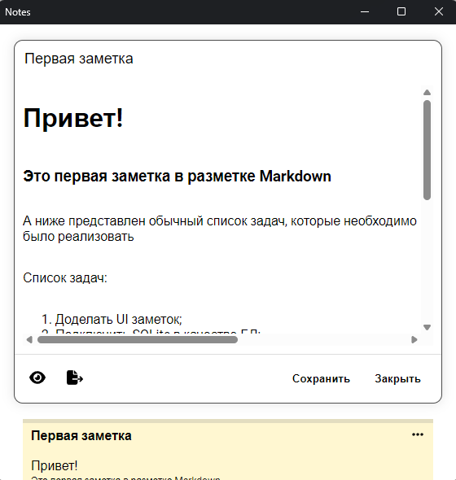
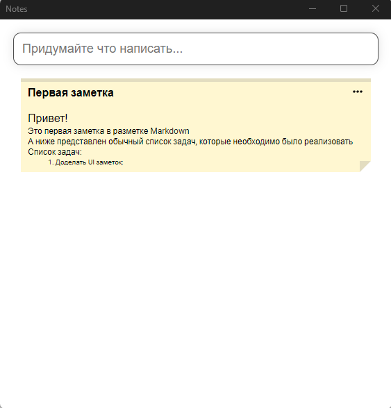

## Notes

Minimalistic note editor in Markdown format.

## Build

The project is built using CMake. 
Download all dependencies (thirdparty) using --recursive git.

### Requirements

- C++23 Compiler
- CMake 3.26.0

## Thirdparties

- [base64pp](https://github.com/matheusgomes28/base64pp)
- [libwebview](https://github.com/a3st/libwebview)
- [simdjson](https://github.com/simdjson/simdjson)
- [SQLiteCpp](https://github.com/SRombauts/SQLiteCpp)
